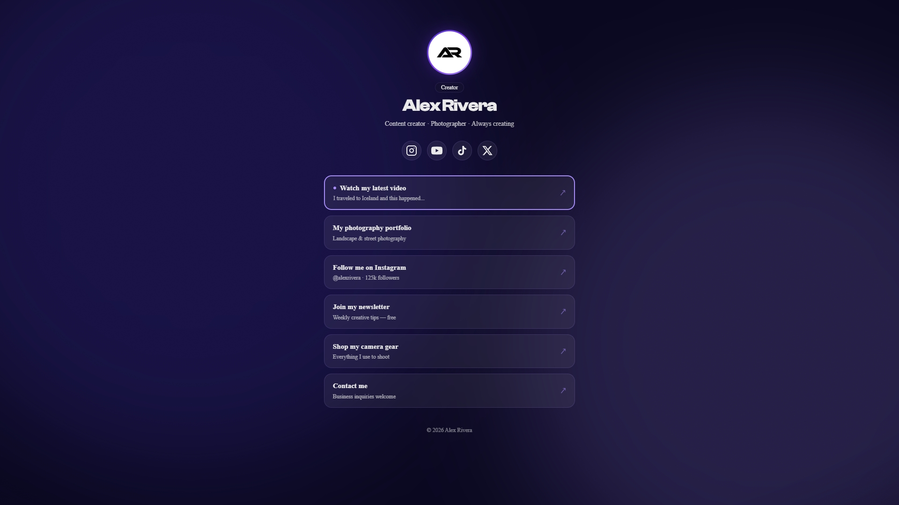
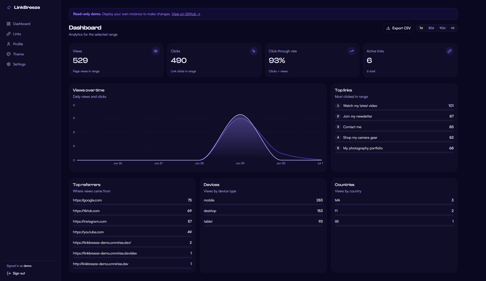
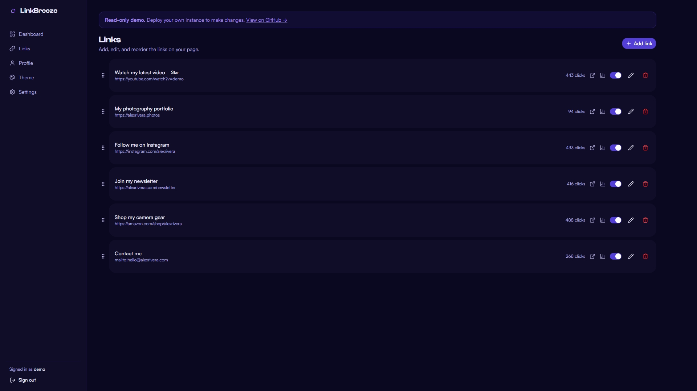
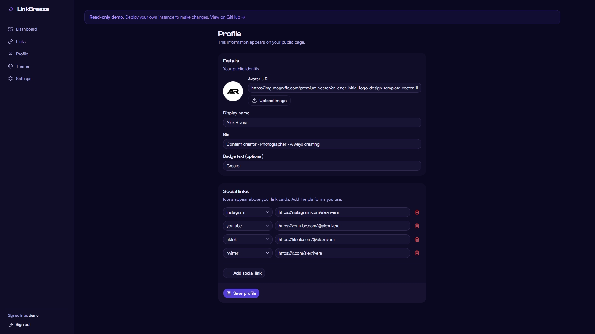
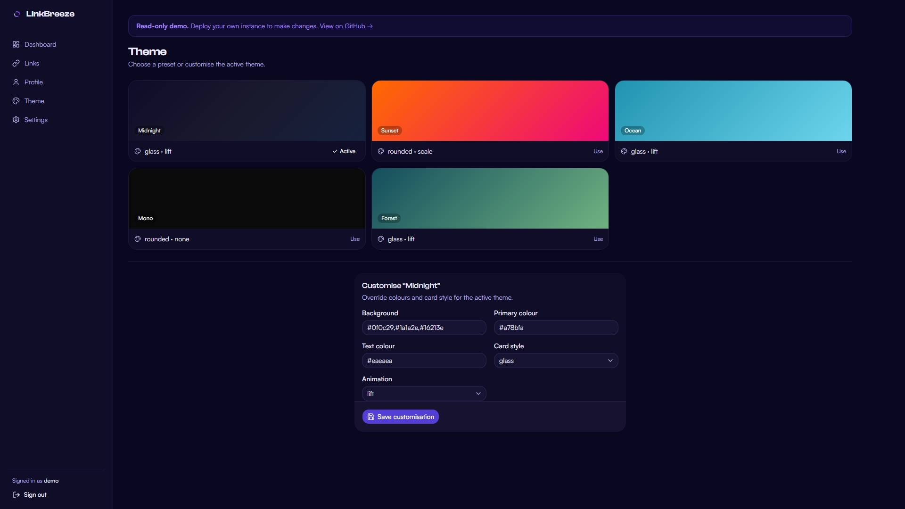
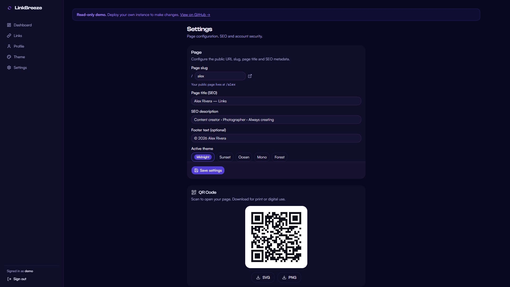

<div align="center">


---

[](LICENSE)
[](https://nextjs.org)
[](https://www.typescriptlang.org)
[](https://github.com/users/Manak-hash/packages/container/package/linkbreeze)
[](https://omnirise.dev)
[](https://www.youtube.com/watch?v=_Ipf-_1B4BY)

[](https://github.com/Manak-hash/LinkBreeze/actions/workflows/ci.yml)
[](https://github.com/Manak-hash/LinkBreeze/releases/latest)
[](https://github.com/Manak-hash/LinkBreeze/commits)

</div>

---

> **Stop paying $15/mo for Linktree.** LinkBreeze gives you links, analytics,
> QR codes, themes, and a real admin panel — free, forever, in one Docker command.

**[🔗 Live Demo](https://linkbreeze-demo.omnirise.dev/alex)** — see the public page in action (read-only).

**[🔐 Demo Dashboard](https://linkbreeze-demo.omnirise.dev/login)** — log in with `demo` / `demo1234` to explore the admin panel.

## ✨ Features

- **🔗 Link Management** — Add, reorder, and customize unlimited links with drag-and-drop
- **🖼️ Link Thumbnails** — Add images to your links for visual preview cards
- **🎵 Embed Widgets** — Embed YouTube, Spotify, SoundCloud, Vimeo, or Bandcamp directly on your page
- **⏰ Link Scheduling** — Schedule links to appear/disappear automatically with date/time controls
- **📊 Privacy-First Analytics** — Page views, click tracking, referrers — no cookies, no tracking
- **📈 External Analytics** — Inject Plausible, Umami, Matomo, or Google Analytics with one paste
- **🎨 Themes** — 9 built-in presets (Aurora, Glassmorphism, Neon Cyberpunk, Editorial Paper, Terminal Mono, Pastel Soft, Brutalist, Retro Sunset, Minimal Light) + full customizer with CSS token system (colors, 10 fonts, 8 background types, 6 card styles, layout controls, effects) + theme duplicate/import/export
- **✏️ Custom CSS** — Fine-tune your page with raw CSS injection
- **📧 Email Capture** — Collect subscriber emails on your public page, export to CSV
- **📱 Mobile-First** — Gorgeous on every screen. Loads in under 300ms. Zero client JavaScript.
- **🎯 QR Codes** — Auto-generated for your page. Download as SVG or PNG.
- **🔒 Self-Hosted** — Your data, your server. No tracking. No ads. No subscription.
- **🐳 One-Command Deploy** — Docker compose and you're live

## 🚀 Quick Start

> Zero config. One command. Your Linktree alternative is live in 30 seconds.

### 🐳 Docker (Recommended)

The fastest path to production. No Node.js, no npm, no config files needed.

**Linux / macOS / Windows CMD** — run as a single line:

```bash
docker run -d --name linkbreeze --restart unless-stopped -p 3000:3000 -v linkbreeze-data:/app/data ghcr.io/manak-hash/linkbreeze:latest
```

**Windows PowerShell** — same command, use backticks for line breaks:

```powershell
docker run -d `
  --name linkbreeze `
  --restart unless-stopped `
  -p 3000:3000 `
  -v linkbreeze-data:/app/data `
  ghcr.io/manak-hash/linkbreeze:latest
```

Then open http://localhost:3000 — the setup wizard takes under 30 seconds.

> **Database migrations run automatically** on container startup — no manual
> `drizzle-kit migrate` needed for Docker deployments.

> **First time?** Make sure Docker Desktop (Windows/Mac) or the Docker daemon
> (Linux) is running before you execute the command.

### 🧩 Docker Compose

Best if you want to customize ports, add a reverse proxy, or manage updates easily.

**Option A — Pull the pre-built image (fastest, no build step):**

Create a `docker-compose.yml` with:

```yaml
services:
  linkbreeze:
    image: ghcr.io/manak-hash/linkbreeze:latest
    ports:
      - "3000:3000"
    volumes:
      - linkbreeze-data:/app/data
    restart: unless-stopped

volumes:
  linkbreeze-data:
```

Then:

```bash
docker compose up -d
```

**Option B — Build from source (for development or customization):**

```bash
git clone https://github.com/Manak-hash/LinkBreeze.git
cd LinkBreeze
docker compose up -d --build
```

Check logs anytime with:

```bash
docker compose logs -f linkbreeze
```

Upgrade to the latest version:

```bash
docker compose pull && docker compose up -d
```

### 🔧 Manual (without Docker)

```bash
git clone https://github.com/Manak-hash/LinkBreeze.git
cd LinkBreeze

npm install

# Configure environment
cp .env.example .env
# Edit .env to set your SECRET_KEY and DATABASE_PATH if needed

# Run database migrations
npm run db:migrate

# Start development server
npm run dev
```

> For production, use npm run build && npm start instead of npm run dev.

## 🌐 Making Your Page Public

LinkBreeze runs on your server. Once deployed, your page is accessible to anyone
at `https://your-domain.com/your-slug`. Here's how to get it online:

### Option 1: Reverse Proxy with Your Domain

Point your domain's A record to your server IP, then use a reverse proxy with
automatic HTTPS:

<details>
<summary>Caddy (recommended — auto HTTPS)</summary>

```
links.example.com {
    reverse_proxy localhost:3000
}
```

</details>

<details>
<summary>nginx</summary>

```nginx
server {
    server_name links.example.com;
    location / {
        proxy_pass http://localhost:3000;
        proxy_set_header Host $host;
        proxy_set_header X-Real-IP $remote_addr;
        proxy_set_header X-Forwarded-For $proxy_add_x_forwarded_for;
        proxy_set_header X-Forwarded-Proto $scheme;
    }
}
```

</details>

### Option 2: Cloudflare Tunnel (no open ports)

No domain purchase or port forwarding needed:

```bash
cloudflared tunnel --url http://localhost:3000
```

## 📸 Screenshots

<details>
    <summary>Click to expand</summary>
    <br/>

<table>
    <tr>
    <td>Public Page</td>
    <td>Admin Dashboard</td>
    </tr>
    <tr>
    <td></td>
    <td></td>
    </tr>
    <tr>
    <td>Links</td>
    <td>Profile</td>
    </tr>
    <tr>
    <td></td>
    <td></td>
    </tr>
    <tr>
    <td>Theme</td>
    <td>Settings</td>
    </tr>
    <tr>
    <td></td>
    <td></td>
    </tr>
</table>

</details>

## 🆚 Comparison

| Feature | Linktree | LinkStack | LittleLink | Shako | **LinkBreeze** |
|---------|----------|-----------|------------|-------|----------------|
| **Price** | $15/mo | Free | Free | Free | **Free** |
| **Admin Panel** | ✅ | Slow | ❌ | ❌ | **✅ Fast** |
| **Database** | Theirs | MySQL | None | None | **SQLite** |
| **Built-in Analytics** | Paid | Basic | ❌ | ❌ | **✅ Full** |
| **External Analytics** | ✅ | ✅ | ❌ | ❌ | **✅** |
| **Email Capture** | $9/mo | ❌ | ❌ | ❌ | **✅** |
| **Embed Widgets** | Paid | ❌ | ❌ | ❌ | **✅** |
| **Link Thumbnails** | Paid | ❌ | ❌ | ❌ | **✅** |
| **QR Codes** | ❌ | ❌ | ❌ | ❌ | **✅** |
| **Link Scheduling** | Paid | ❌ | ❌ | ❌ | **✅** |
| **Themes** | Paid | Limited | CSS only | Config | **✅ Full Token System + Import/Export** |
| **Custom CSS** | ❌ | ❌ | ✅ | ❌ | **✅** |
| **Self-Hosted** | ❌ | ✅ | ✅ | ✅ | **✅** |
| **Language** | Closed | PHP | HTML | Astro | **TypeScript** |
| **Docker Deploy** | N/A | Complex | Simple | Simple | **One command** |
| **Page Load** | ~2-3s | ~1-2s | Fast | Fast | **<300ms** |
| **License** | Closed | AGPL | MIT | GPL | **MIT** |

## 🛠️ Tech Stack

| Layer | Technology |
|-------|-----------|
| Framework | Next.js 16 (App Router, Server Components, ISR) |
| Database | SQLite via better-sqlite3 (WAL mode) |
| ORM | Drizzle ORM (type-safe, zero overhead) |
| Auth | Cookie-based HMAC sessions, bcrypt |
| UI | shadcn/ui + Tailwind CSS 4 |
| Drag & Drop | dnd-kit |
| Charts | Recharts |
| QR Codes | qrcode (server-side SVG/PNG) |
| Validation | Zod |
| Icons | Lucide + custom social SVGs |

## 📖 Documentation

- [Contributing Guide](CONTRIBUTING.md)
- [Security Policy](SECURITY.md)
- [Changelog](CHANGELOG.md)
- [Troubleshooting](TROUBLESHOOTING.md)
- [Architecture Decisions](docs/adr/)
- [Configuration Reference](#configuration)

## ⚙️ Configuration

All configuration is via environment variables (`.env`):

| Variable | Default | Description |
|----------|---------|-------------|
| `PORT` | `3000` | Server port |
| `DATABASE_PATH` | `./data/linkbreeze.db` | SQLite database file path |
| `SECRET_KEY` | Auto-generated | HMAC signing key for sessions |

Runtime settings (page slug, title, SEO, theme) are managed via the admin dashboard
and stored in the database — no code changes needed.

## 🎨 Theme System

9 presets are included out of the box: **Aurora** (animated flagship), **Glassmorphism**, **Neon Cyberpunk**, **Editorial Paper**, **Terminal Mono**, **Pastel Soft**, **Brutalist**, **Retro Sunset**, and **Minimal Light**.

The theme engine uses a CSS custom property (`--lb-*`) token system — every color, radius, shadow, and font is a token consumed by the public page components. The customizer gives you full control over:

- **Background** — 8 types (solid, gradient, radial, mesh, aurora, animated gradient, image, pattern) with angle, overlay, and opacity controls
- **Colors** — accent, secondary, text, muted text, card background, card border (hex or rgba)
- **Typography** — 10 curated Google Fonts (Inter, Poppins, Playfair Display, JetBrains Mono, Space Grotesk, DM Sans, Lora, Bebas Neue, Sora, Outfit), font scale, weight, letter spacing
- **Card style** — 6 link styles (pill, rounded, sharp, glass, outline, neon), hover effects, button size, corner radius, border width, shadow strength
- **Layout** — container width, alignment (left/center/right), density (compact/normal/relaxed)
- **Effects** — glow with custom color, glass blur, noise texture, reveal animation
- **Duplicate** — clone any theme (preset or custom) as a new editable copy

All changes apply with zero client JavaScript — the public page remains 100% server-rendered.

## 🤝 Contributing

Contributions are welcome! See [CONTRIBUTING.md](CONTRIBUTING.md) for guidelines.

## 📜 License

MIT — do whatever you want. See [LICENSE](LICENSE).

## 🏢 About

Built by [Manak-hash](https://github.com/Manak-hash) · An [OmniRise](https://omnirise.dev) project.
